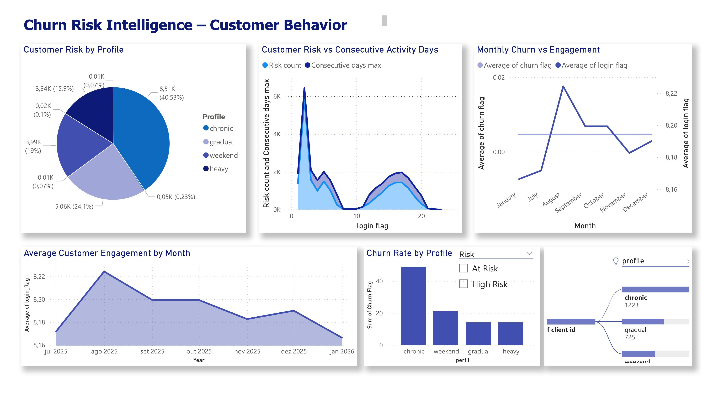

# Churn Risk Intelligence

🇧🇷 Projeto de análise de comportamento de clientes em uma plataforma de streaming simulada.

## Project Overview | Visão Geral

This project analyzes customer behavior and churn risk through data analysis and visualization.
Using simulated engagement data from a streaming platform, the project explores how different customer profiles interact with the service and how engagement patterns relate to potential churn risk.

## Project Objective | Objetivo do Projeto

The main objective of this project is to analyze customer engagement patterns and identify behavioral signals associated with potential churn risk using data analysis techniques.

## Dataset Description | Descrição do Dataset
The dataset used in this project simulates customer engagement behavior.

It includes information such as:
- Customer ID
- Login activity
- Consecutive active days
- Customer profile
- Risk level
- Monthly churn indicators

## Project WorkFlow

1. Behavioral modeling of customer profiles
2. Synthetic dataset generation
3. Data preparation and feature engineering
4. Exploratory data analysis of engagement metrics
5. Dashboard development in Power BI

## Dashboard Insights
The dashboard highlights key behavioral insights such as:

- Risk distribution across customer profiles
- Monthly engagement trends
- Relationship between engagement and churn
- Consecutive activity patterns

## Tools Used | Ferramentas Utilizadas
- Python
- Pandas
- Power BI
- GitHub

## Key Insights

Some important behavioral patterns identified during the analysis:

- Customers with lower login frequency tend to show higher churn risk.
- Consecutive activity days are strongly associated with user retention.
- Different customer profiles demonstrate distinct engagement patterns.

